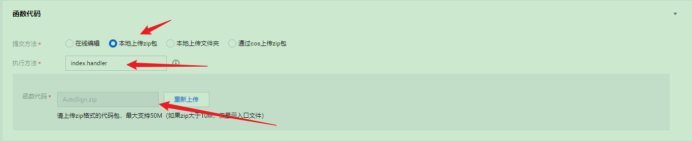
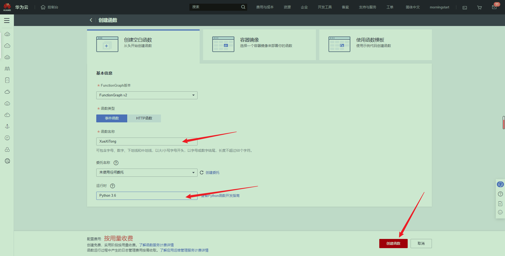

# XueXiTong

学习通小程序

## 功能

1. 支持签到方式支持：普通，图片，手势，定位
2. 支持查询作业、考试的信息（暂不支持云函数）
   - 作业：课程 作业 剩余时间
   - 考试：考试 剩余时间
3. 支持发送签到结果：
   - 邮件
   - sever酱
   - 钉钉机器人（自定义机器人）
4. 支持部署到云函数（兼容所有云函数）

## 安装

- conf.py 配置文件
- index.py 主程序
- auto_send.py 发送消息
- auto_sign.py 自动签到
- auto_note.py 查询作业等

### 配置文件

加:warning:的是必填内容的

- account: 手机号:warning:
- password: 密码:warning:
- long: 经度
- lat: 纬度
- address: 地址
- name: 打卡显示姓名:warning:
- img: 图片链接，用于图片打卡
- email: 接受邮件的邮箱地址
- mail_host: 邮箱服务器地址
- mail_user: 邮箱用户名（账号）
- mail_password: 邮箱密码（授权码）
- SCKEY: Server酱密钥
- dingding_hook: 钉钉机器人的hoke

账号和密码不确定可以先在[学习通官网](https://passport2.chaoxing.com/login?fid=&newversion=true&refer=https%3A%2F%2Fi.chaoxing.com)尝试以下，再输入

### 配置参考文档

- [网易邮箱获取授权码](https://help.mail.163.com/faqDetail.do?code=d7a5dc8471cd0c0e8b4b8f4f8e49998b374173cfe9171305fa1ce630d7f67ac21b8ba4d48ed49ebc)
- [server酱](https://sct.ftqq.com/)
- [钉钉机器人](https://open.dingtalk.com/document/robots/custom-robot-access)

## 云函数

- [腾讯云函数](https://github.com/morning-start/XueXiTong/wiki/%E8%85%BE%E8%AE%AF%E4%BA%91%E5%87%BD%E6%95%B0)
- [华为云函数]()

## 版权说明

该项目签署了 GPL 授权许可，详情请参阅 LICENSE.md

## 鸣谢

[给我一碗炒饭](https://www.bilibili.com/video/av94208525) 签到
[xsk666](https://github.com/xsk666) 查询作业
