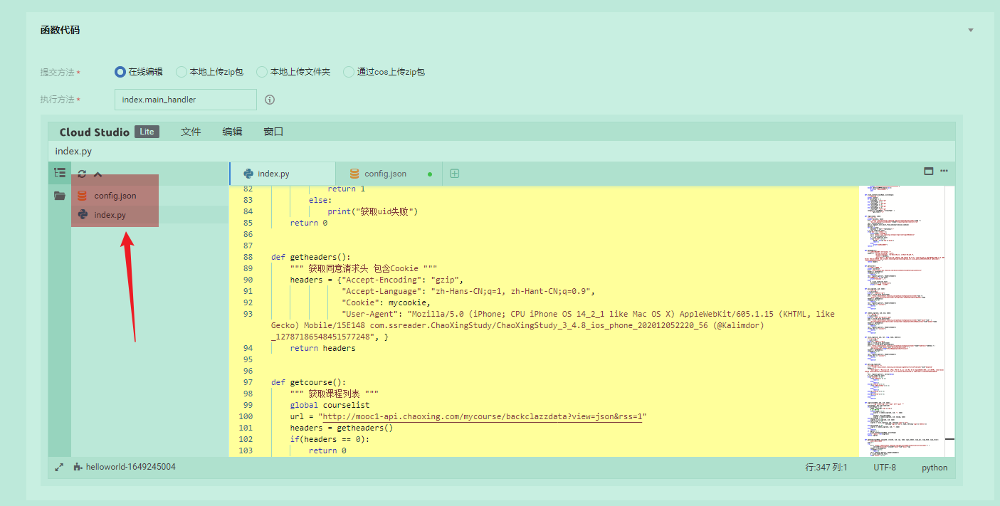
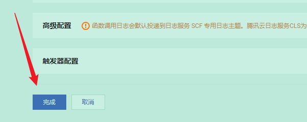
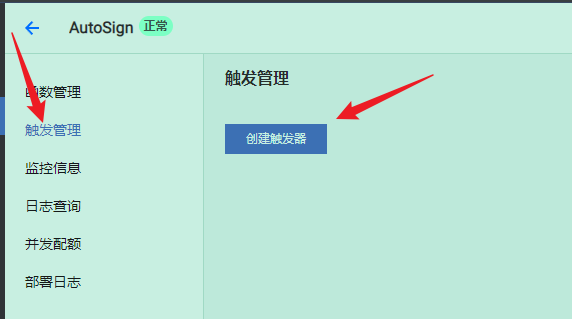
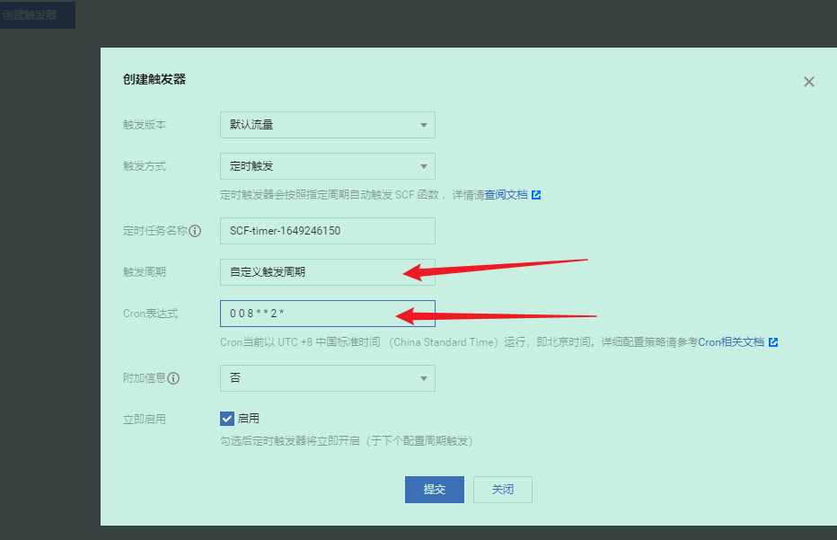

# AutoSign

学习通自动签到

1. 签到方式支持：普通，图片，手势，定位
2. 签到成功自动发送邮件
3. 部署到腾讯云函数（更准时）

## 使用方法

1. 右上角 fork(+star)
2. 在 `Setting` 中侧栏找到 `Secrets` 的 `Actions`
3. 点击右上角 `New repository secret` 添加**所有**配置（如下）
4. 在 `Actions` 中开始 workflow

## 配置

加:warning:的是必填内容的；其他的可以不填内容，但一定要添加到 `Secrets` 中

- ACOUNT: 手机号:warning:
- PASSWORD: 密码:warning:
- ADDRESS: 地址:warning:
- NAME: 打卡显示姓名:warning:
- IMG: 图片链接，用于图片打卡
- LONGITUDE: 经度
- LATITUDE: 纬度
- EMAIL: 接受邮件的邮箱地址
- MAIL_HOST: 邮箱服务器地址
- MAIL_USER: 邮箱用户名（账号）
- MAIL_PASSWORD: 邮箱密码（授权码）

账号和密码不确定可以先在[学习通官网](https://passport2.chaoxing.com/login?fid=&newversion=true&refer=https%3A%2F%2Fi.chaoxing.com)尝试以下，再输入

### 时间设置

在 `Actions` 里点击三点，`view workflow file` 修改 yml 文件

```yml
schedule:
  - cron: "* * * * *"
```

corn 对应的就是时间，格式是`分钟 小时 日 月 星期`可以看[github 的官方文件](https://docs.github.com/en/actions/using-workflows/events-that-trigger-workflows#schedule)

懒得看的也可以用这两个
[crontab](https://crontab.guru/)查看 corn 意义
[corn](https://cron.qqe2.com/)返回 corn 表达式

注意：corn 设置的时间是 UTC，时间的话要加八小时。例如 UTC:00:00 就是时间 08:00

```txt
┌───────────── minute (0 - 59)
│ ┌───────────── hour (0 - 23)
│ │ ┌───────────── day of the month (1 - 31)
│ │ │ ┌───────────── month (1 - 12 or JAN-DEC)
│ │ │ │ ┌───────────── day of the week (0 - 6 or SUN-SAT)
│ │ │ │ │
│ │ │ │ │
│ │ │ │ │
* * * * *
```

| 算子 | 描述         | 例子                                                                                  |
| ---- | ------------ | ------------------------------------------------------------------------------------- |
| \*   | 任何值       | 15 \* \* \* \*每天每小时每分钟 15 分钟运行。                                          |
| ,    | 值列表分隔符 | 2,10 4,5 \* \* \*在每天第 4 小时和第 5 小时的第 2 分钟和第 10 分钟运行。              |
| -    | 值范围       | 30 4-6 \* \* \*在第 4、5 和 6 小时的第 30 分钟运行。                                  |
| /    | 步长值       | 20/15 \* \* \* \*从第 20 分钟到第 59 分钟（第 20、35 和 50 分钟）每 15 分钟运行一次。 |

## 云函数

据我使用，发现 Action 的定时不准，所以使用云函数调用

我使用的是[腾讯云函数](https://cloud.tencent.com/product/scf/)免费的够用了

搭建云函数所有需要用到的文件都在云函数文件夹里，按照如下步骤修改，并上传到云函数

第一步，新建一个云函数，如图操作


第二步，创建文件


index.py 就用 `/云函数/index.py` 全部覆盖
config.json 是配置文件，填写要求查看上文的配置

还有一些自主配置，`sign_` 开头的是签到方式，1 表示开启，0 表示关闭

第三步，点击完成



第四步，配置时间




### [官方文档](https://cloud.tencent.com/document/product/583/9708)

Cron 表达式
创建定时触发器时，用户能够使用标准的 Cron 表达式的形式自定义何时触发。定时触发器现已推出秒级触发功能，为了兼容老的定时触发器，因此 Cron 表达式有两种写法。

Cron 表达式语法一（推荐）
Cron 表达式有七个必需字段，按空格分隔。

| 第一位 | 第二位 | 第三位 | 第四位 | 第五位 | 第六位 | 第七位 |
| ------ | ------ | ------ | ------ | ------ | ------ | ------ |
| 秒     | 分钟   | 小时   | 日     | 月     | 星期   | 年     |

其中，每个字段都有相应的取值范围：

| 字段 | 值                                                                                | 通配符    |
| ---- | --------------------------------------------------------------------------------- | --------- |
| 秒   | 0 - 59 的整数                                                                     | `, - * /` |
| 分钟 | 0 - 59 的整数                                                                     | `, - * /` |
| 小时 | 0 - 23 的整数                                                                     | `, - * /` |
| 日   | 1 - 31 的整数（需要考虑月的天数）                                                 | `, - * /` |
| 月   | 1 - 12 的整数或 JAN,FEB,MAR,APR,MAY,JUN,JUL,AUG,SEP,OCT,NOV,DEC                   | `, - * /` |
| 星期 | 0 - 6 的整数或 SUN,MON,TUE,WED,THU,FRI,SAT。其中 0 指星期日，1 指星期一，以此类推 | `, - * /` |
| 年   | 1970 - 2099 的整数                                                                | `, - * /` |

## 贡献

感谢 [给我一碗炒饭](https://www.bilibili.com/video/av94208525) 的主要代码

主要签到代码都是 copy 这位大佬的，我增加了图片打卡的方法

## 更新功能

v0.0.1
增加了签到成功自动发邮件功能，mail 开头的参数都是发件邮箱的参数，不填写默认关闭
v0.02
完善使用云函数自动签到，使时间准确
