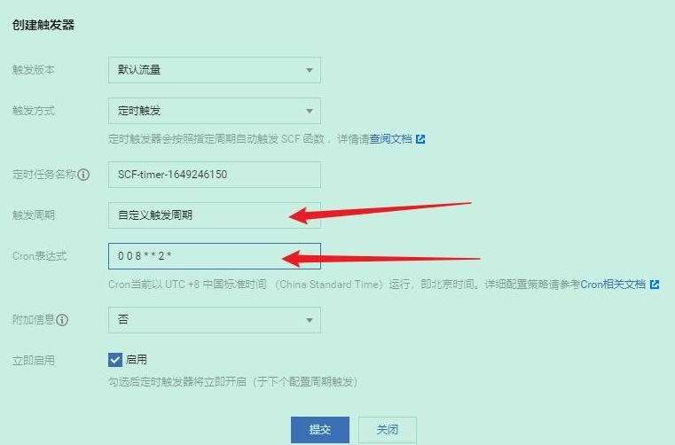

# AutoSign

学习通自动签到

1. 签到方式支持：普通，图片，手势，定位
2. 发送签到结果：
   - 邮件
   - sever酱
   - 钉钉机器人（自定义机器人）
3. 部署到云函数（更准时）

## 安装

- conf.py 配置文件
- index.py 主程序
- send.py 发送消息
- auto_sign.py 自动签到

### 配置文件

加:warning:的是必填内容的

- account: 手机号:warning:
- password: 密码:warning:
- long: 经度
- lat: 纬度
- address: 地址
- name: 打卡显示姓名:warning:
- img: 图片链接，用于图片打卡
- email: 接受邮件的邮箱地址
- mail_host: 邮箱服务器地址
- mail_user: 邮箱用户名（账号）
- mail_password: 邮箱密码（授权码）
- SCKEY: Server酱密钥
- dingding_hook: 钉钉机器人的hoke

账号和密码不确定可以先在[学习通官网](https://passport2.chaoxing.com/login?fid=&newversion=true&refer=https%3A%2F%2Fi.chaoxing.com)尝试以下，再输入

### 配置参考文档

- [网易邮箱获取授权码](https://help.mail.163.com/faqDetail.do?code=d7a5dc8471cd0c0e8b4b8f4f8e49998b374173cfe9171305fa1ce630d7f67ac21b8ba4d48ed49ebc)
- [server酱](https://sct.ftqq.com/)
- [钉钉机器人](https://open.dingtalk.com/document/robots/custom-robot-access)

## [腾讯云函数](https://cloud.tencent.com/product/scf/)

:warning: TX 要收费了，只有三月的免费试用。具体看官方[购买指南](https://cloud.tencent.com/document/product/583/12280)

### 步骤

配置云函数的步骤都差不多，都可以参考如下步骤，现以腾讯云函数为例

#### 第一步，新建一个云函数

#### 第二步，上传压缩包

:eyes:AutoSign.zip 包括 index.py, send.py, auto_sign.py, conf.py

  

#### 第三步，点击完成

#### 第四步，填写配置并测试

conf.py 是配置文件，填写要求看[配置](#配置文件)

还有一些自主配置，`sign_` 开头的是签到方式，1 表示开启，0 表示关闭

#### 第五步，配置触发器

具体用法查看[配置](#cron-表达式)

### Cron 表达式

[官方文档](https://cloud.tencent.com/document/product/583/9708)

创建定时触发器时，用户能够使用标准的 Cron 表达式的形式自定义何时触发。定时触发器现已推出秒级触发功能，为了兼容老的定时触发器，因此 Cron 表达式有两种写法。

Cron 表达式语法一（推荐）
Cron 表达式有七个必需字段，按空格分隔。

| 第一位 | 第二位 | 第三位 | 第四位 | 第五位 | 第六位 | 第七位 |
| ------ | ------ | ------ | ------ | ------ | ------ | ------ |
| 秒     | 分钟   | 小时   | 日     | 月     | 星期   | 年     |

其中，每个字段都有相应的取值范围：

| 字段 | 值                                                                                | 通配符    |
| ---- | --------------------------------------------------------------------------------- | --------- |
| 秒   | 0 - 59 的整数                                                                     | `, - * /` |
| 分钟 | 0 - 59 的整数                                                                     | `, - * /` |
| 小时 | 0 - 23 的整数                                                                     | `, - * /` |
| 日   | 1 - 31 的整数（需要考虑月的天数）                                                 | `, - * /` |
| 月   | 1 - 12 的整数或 JAN,FEB,MAR,APR,MAY,JUN,JUL,AUG,SEP,OCT,NOV,DEC                   | `, - * /` |
| 星期 | 0 - 6 的整数或 SUN,MON,TUE,WED,THU,FRI,SAT。其中 0 指星期日，1 指星期一，以此类推 | `, - * /` |
| 年   | 1970 - 2099 的整数                                                                | `, - * /` |

## 画饼

可能会拥有的功能

1. 未完成作业查询功能

## 版权说明

该项目签署了 GPL 授权许可，详情请参阅 LICENSE.md

## 鸣谢

[给我一碗炒饭](https://www.bilibili.com/video/av94208525) 的签到代码
